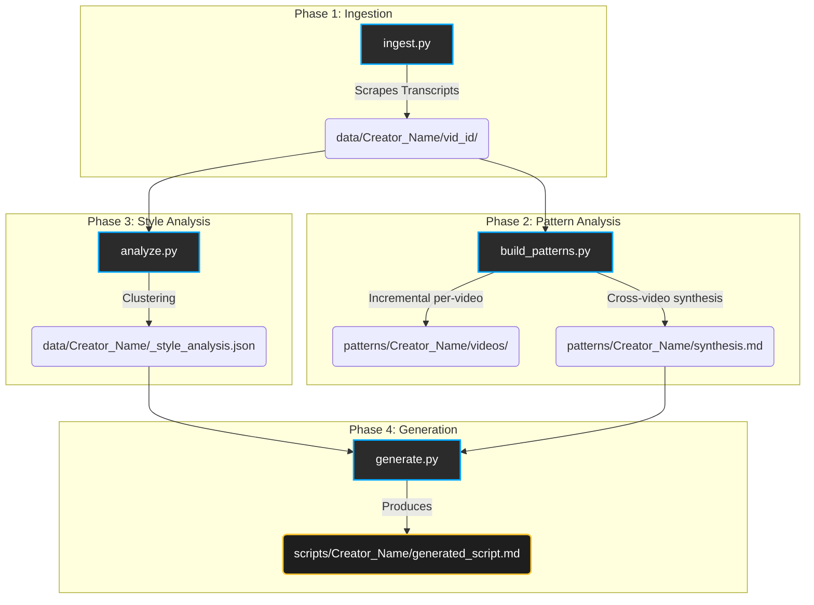

# YouTube Shorts AI Clone Pipeline

This automated pipeline ingests YouTube Shorts transcripts, analyzes the storytelling style and patterns of different creators, and builds a "DNA profile" to generate new scripts mimicking their exact style.

## 🏗 System Architecture & Data Flow

The pipeline operates in four distinct phases: Ingestion, Pattern Analysis, Style Clustering, and Script Generation.



## 🔄 GitHub Actions Automation

To prevent hitting YouTube's rate limits (429 errors), this pipeline runs automatically on **GitHub Actions**. By using GitHub's ephemeral runners, the IP address naturally rotates, reducing blocks.

### The Automated Workflow (`.github/workflows/pipeline.yml`)

1. **Scheduled Runs:** The workflow runs twice daily. It gracefully fetches only the newest 5 videos (`--limit 5`) using an incremental check to prevent data corruption.
2. **Analysis:** It safely calculates patterns for new downloads (`--incremental`).
3. **Commit:** All new `data/` and `patterns/` are automatically committed directly back to the repository by `stefanzweifel/git-auto-commit-action`. Existing data is completely safe and unaffected since the scripts only append or overwrite specific files in a localized manner.

---

## 🚀 Local Usage

### 1. Ingestion Target
Fetches transcripts. Has built-in delays to be kind to the APIs.
```bash
# Fetch latest 5 videos for every active creator in creators.json
python ingest.py --limit 5

# Fetch for a specific creator only
python ingest.py --creator GenZway
```

### 2. Pattern Analysis
Analyzes pacing (Words-Per-Second), hook types, closures, and language mix.
```bash
# Run incremental analysis (skips files that haven't changed)
python build_patterns.py --incremental
```

### 3. Style Analysis
Runs K-Means clustering (or similar) to group video styles.
```bash
# Run style analysis and produce DNA profile
python analyze.py
```

### 4. Generative Templates
Binds the style DNA into a brand new template.
```bash
python generate.py --creator GenZway --topic "My New Topic"
```

## 🛡️ Data Handling Security

The automated scraping uses `--incremental` logic:
* `ingest.py` checks exactly what videos are missing from `<dir>/_channel_meta.json` before hitting the API.
* `build_patterns.py` saves file hashes in `_meta.json`. If a transcript hasn't changed, the pipeline instantly skips it, keeping the process ultra-fast and preventing data wipes.
